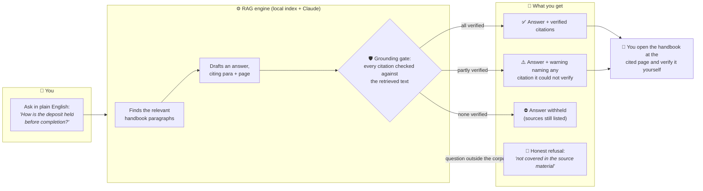
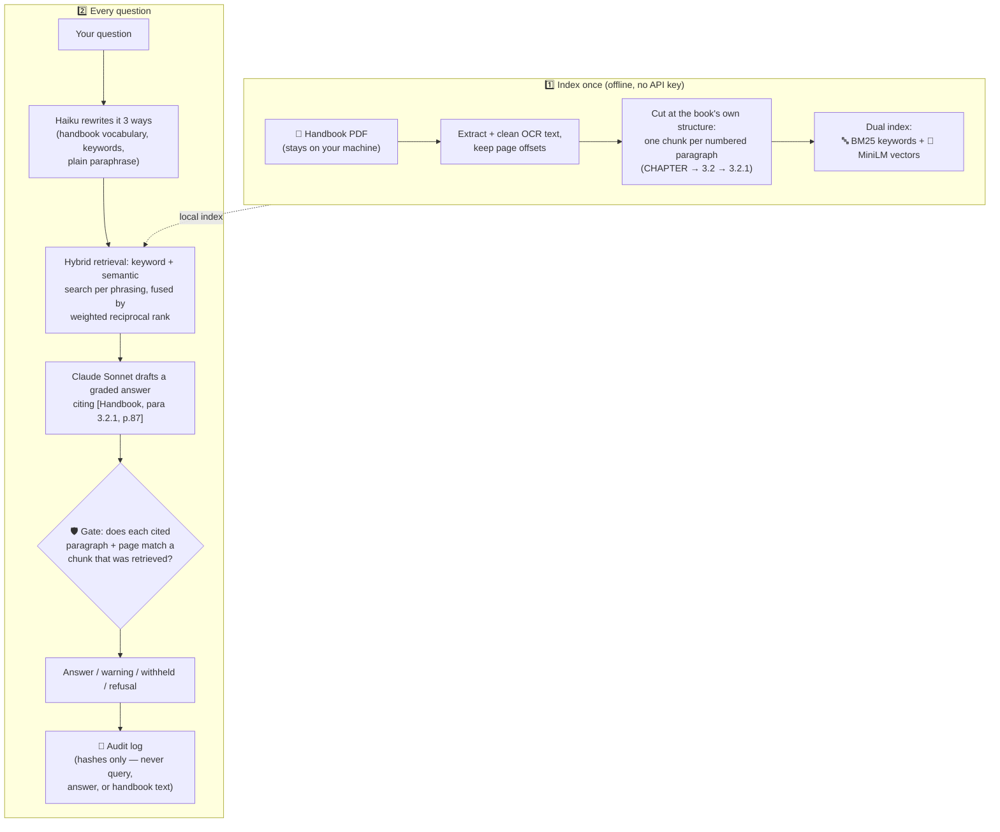

# Legal RAG Pipeline — a first-line sweep of the conveyancing handbook

Ask a procedure question in plain English. Get a grounded answer with **verified
chapter/paragraph/page citations** — or an honest refusal. Then open the handbook at the cited
page and reach your own conclusion.

That last step is the whole point. This tool is **not** built to replace reading the source: it's a
first-line sweep our team runs before diving into an ~800-page manual. The answer orients you; the
**citation is the product** — every one is machine-verified against the retrieved text before you
see it, so `[Handbook, para 6.3.2, p.214]` reliably lands you on the paragraph that actually says
it. An answer that cannot be verified is **withheld, not shown** — the system fails closed rather
than guessing confidently.

## The user journey



Four possible outcomes, never a confident unchecked guess:

| Outcome | When | What you see |
| --- | --- | --- |
| ✅ **Verified answer** | The handbook covers it | Answer + citations, each verified against a retrieved chunk |
| ⚠️ **Partial verification** | Some citations couldn't be checked | Answer + a warning **naming each unverified citation** |
| ⛔ **Withheld** | No citation could be verified | The draft is blocked; retrieved sources shown so you can still look |
| 🚫 **Refusal** | The question is outside the corpus | The exact sentence "not covered in the source material" |

## How it works, step by step



Why each step exists, in one line each:

1. **Page-aware ingestion** — page numbers are preserved from the first byte, because a citation
   without a page is unverifiable.
2. **Structure-aware chunking** — chunks follow the author's own paragraph numbering, so a citation
   names a real unit of meaning, not an arbitrary text window.
3. **Dual (hybrid) retrieval** — legal questions hinge on exact tokens ("s.72 burdens", "Form 60");
   keyword search catches what semantic search fuzzes past, and vice versa.
4. **Query expansion** — staff phrase questions colloquially; the handbook doesn't. Three quick
   rewrites bridge the vocabulary gap (skippable with `--no-rewrite`).
5. **Graded answers** — direct answer, partial answer that names its gaps, closest-related guidance
   under an explicit caveat, or an exact refusal — never a shrug dressed up as an answer.
6. **The grounding gate** — the step that makes the citations trustworthy: every `(paragraph, page)`
   the model cites is checked against the chunks actually retrieved. Invented citations don't pass.

## Try it — interactive demo, no install

**[`Demo/demo.html`](Demo/demo.html)** is a self-contained interactive walkthrough — open it in any
browser (download the file, or clone and double-click). It runs the pipeline's logic as a guided
simulation over the **wholly synthetic sample handbook** (a fictional jurisdiction — no real corpus
text), and shows all four outcomes above, including watching the gate catch a fabricated citation.

## Try it — real pipeline, fresh clone (no API key needed)

The real corpus is **copyrighted and never in this repo**, so the quickstart runs against the same
synthetic sample handbook (`scripts/sample_corpus.py`) that exercises the identical chunker grammar:

```bash
python -m venv .venv && source .venv/bin/activate
pip install -r requirements.txt          # installs torch/sentence-transformers (heavy, one-time)
python -m pytest tests/ -q               # full suite, offline, no key

python scripts/build_sample_index.py     # builds ./sample_chroma_db/ (downloads MiniLM ~90MB once)
python -m src.pipeline eval \
  --golden eval/sample_golden_set.jsonl \
  --persist-dir sample_chroma_db \
  --skip-refusals --skip-completeness     # keyless retrieval-only eval → 7/7 on the sample set
```

This is exactly what CI runs (`.github/workflows/ci.yml`) — no `ANTHROPIC_API_KEY` anywhere.

**With an API key** (`cp .env.example .env`, set `ANTHROPIC_API_KEY`) you can generate real answers
and index your own handbook:

```bash
python -m src.pipeline query "How is a Windlass Charge created?" --persist-dir sample_chroma_db --top-k 6
python -m src.pipeline query "What is the capital gains tax rate?" --persist-dir sample_chroma_db   # → refusal
python -m src.pipeline index ./data/your-handbook.pdf --type handbook   # --reset to rebuild
```

## Does it actually work? (evaluation at a glance)

- **Held-out headline: strict hit@6 = 20/20 = 1.000** (95% CI 0.839–1.000) — on questions authored
  *after* the retrieval constants were frozen and never used for tuning.
- **Citation integrity: 473/473 citations grounded** across all three eval sets — the number that
  matters most for the "citations are the product" claim.
- **The honest number: 0.412 strict hit@6 on messy real-staff phrasing** — a deliberately hard
  "realistic" slice built from real field-test failures, published as the baseline the next phase
  is measured against, not hidden.

Full ablation tables, refusal accuracy, methodology, and provenance:
[`ABOUT.md`](ABOUT.md) and the canonical report [`eval/results.md`](eval/results.md).

## Data handling, in one paragraph

The handbook is copyrighted, so the PDF, the index, and all logs are gitignored and **never
committed** — this public repo ships only code, tests, the synthetic sample, and scrubbed eval
reports (questions and section numbers, never corpus text). The audit log records **SHA-256 hashes**
of queries, not their text — legal queries can reveal client matters. Full detail in
[`ABOUT.md`](ABOUT.md#data-handling).

## More detail

- [`ABOUT.md`](ABOUT.md) — architecture, full evaluation, deployment notes, limitations,
  troubleshooting, roadmap.
- [`docs/decisions.md`](docs/decisions.md) — design rationale, one entry per meaningful choice,
  append-only (D1–D48).
- [`docs/harness.md`](docs/harness.md) — the development workflow itself (gates, fresh-context
  critics, eval-judged bake-offs).
- [`IMPLEMENTATION_PLAN.md`](IMPLEMENTATION_PLAN.md) — phase-by-phase build plan.

## License

[MIT](LICENSE) © 2026 Ahsan Malik — covers everything in this repository, **including the wholly
synthetic sample corpus**. The real conveyancing handbook is never distributed here.
