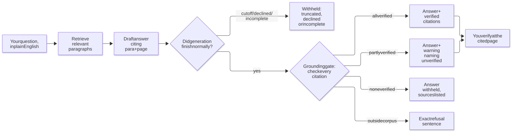
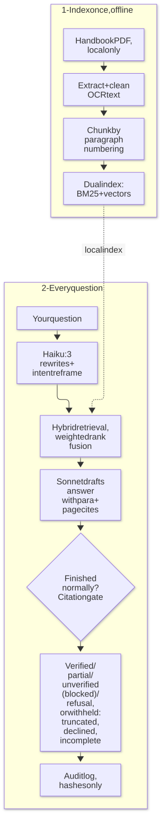

# Legal RAG Pipeline — a first-line sweep of the conveyancing handbook

[](https://github.com/Ahsan-ire/rag-pipeline-v1/actions/workflows/ci.yml)
&nbsp; **[▶ Live interactive demo](https://ahsan-ire.github.io/rag-pipeline-v1/Demo/demo.html)** — no install, runs in the browser.

Ask a procedure question in plain English. Get a grounded answer with **chapter/paragraph/page
citations whose locators are checked against the retrieved text**, or an honest refusal. Then open the handbook at the cited
page and reach your own conclusion.

That last step is the whole point. This tool is **not** built to replace reading the source: it's a
first-line sweep before diving into an ~800-page manual. The answer orients you. The
**citation is the product**: before you see the answer, each citation is matched against the chunks
retrieved for your question. The cited paragraph must be the section of a retrieved chunk (or nest
inside it), and the cited page must fall within that chunk's pages, so `[Handbook, para 6.3.2, p.214]`
lands you on retrieved text. That check does not prove the exact paragraph number exists, and it does
not prove the passage supports the claim. A sentence with no citation is not checked at all. An answer
whose citations cannot be verified is **withheld, not shown**, and an answer that was cut off,
declined by the model, or otherwise did not finish is withheld too. The system fails closed rather
than guessing confidently.

## Why I built this, and how it's used

I work with a small legal team specialising in conveyancing, and the reference for almost
everything is one ~800-page handbook. Finding the right paragraph is rarely hard law; mostly it's paging. A general-purpose AI
answers instantly but leaves you wondering whether to trust it, which in legal work means you end
up checking the book anyway. This is the middle path: an answer that arrives already pinned to
chapter, paragraph and page, so the check takes seconds instead of a search.

It has been in real use since mid-July 2026: mostly me, sometimes colleagues on their own
questions, always on real work, never as the final word. Two things in this repo came
directly out of that use: the "realistic" evaluation slice is built
from colleagues' actual phrasing, which failed badly against a system that scored perfectly on my
own polished test questions (see the evaluation section), and the Phase 14 comparison-question
work started as one colleague's complaint about one bad answer. I haven't measured time saved and
won't invent a number. What I can say is that the failures users found became the roadmap.

## The user journey

<picture>
  <source media="(prefers-color-scheme: dark)" srcset="docs/diagrams/user-journey-dark.svg">
  
</picture>

Every query ends in exactly one outcome. None of them is a confident, unchecked guess:

| Outcome | When | What you see |
| --- | --- | --- |
| ✅ **Verified** (`CITATIONS_VERIFIED`) | Every citation resolves to a retrieved chunk | Answer + citations, a `Source:` label naming the handbook title(s), and a research-aid disclaimer |
| ⚠️ **Partially verified** (`PARTIALLY_VERIFIED`) | Some citations couldn't be checked | Answer + a warning **naming each unverified citation**, plus the `Source:` label and disclaimer |
| ⛔ **Unverified, blocked** (`CITATIONS_UNVERIFIED`) | No citation could be verified | The draft is withheld; retrieved source headers shown so you can still look. `--show-unverified` reveals the draft, branded as an unverified draft |
| 🚫 **Refusal** (`REFUSAL`) | The question is outside the corpus | The exact sentence "not covered in the source material" |
| ✂️ **Answer truncated** (`ANSWER_TRUNCATED`) | The model hit its output limit mid-answer | Withheld, with a notice to try a narrower question. No sources, no override |
| 🙅 **Model declined** (`MODEL_DECLINED`) | The model declined the request | Withheld, with a notice to rephrase or consult the handbook. No sources, no override |
| ❓ **Generation incomplete** (`GENERATION_INCOMPLETE`) | Generation stopped for any other abnormal reason | Withheld, with a notice to retry. No sources, no override |
| (none) `no_results` | Retrieval returned nothing | A no-results message; no answer is generated |

The three withheld terminal outcomes take precedence over every citation outcome, including
`--show-unverified`: a cut-off or declined draft is never printed. If the model returns no stop
reason at all, the citation gate still decides whether the answer is shown; when it is shown, it
carries a warning that its completion status could not be confirmed.

What the verified outcomes do and don't claim: the check matches each cited paragraph/page against
the chunks retrieved for that question (a related section number, and a page inside that chunk's
pages). It does **not** check that the exact paragraph exists or that it supports the sentence it
follows, and it does not check statements that carry no citation. As a display-only hint, the output lists sentences that appear to have no citation
under "These statements may not be backed by a citation (heuristic)". It is a heuristic, it never
changes the outcome, and it can miss cases (for example sentences starting in lowercase). Verified
and partially verified answers, and an unverified draft shown with `--show-unverified`, end with
"Research aid — check the cited paragraphs; not legal advice; the source edition may predate current
law." (the `Source:` label appears on the verified and partially verified answers only).

(These are the pipeline's outcomes, the first four of which the demo below illustrates. The answer
*text* itself is separately graded — direct answer, partial answer naming its gaps, closest-related
guidance under an explicit caveat, or the refusal — detailed in [`ABOUT.md`](ABOUT.md).)

## How it works, step by step

<picture>
  <source media="(prefers-color-scheme: dark)" srcset="docs/diagrams/pipeline-steps-dark.svg">
  
</picture>

Why each step exists, in one line each:

1. **Page-aware ingestion** — page numbers are preserved from the first byte, because a citation
   without a page is unverifiable.
2. **Structure-aware chunking** — chunks follow the author's own paragraph numbering, so a citation
   names a real unit of meaning, not an arbitrary text window.
3. **Dual (hybrid) retrieval** — legal questions hinge on exact tokens ("s.72 burdens", "Form 60");
   keyword search catches what semantic search fuzzes past, and vice versa.
4. **Query expansion** — staff phrase questions colloquially; the handbook doesn't. Three quick
   rewrites plus an intent-level reframe (what is the question *really* asking?) bridge the
   vocabulary gap (skippable with `--no-rewrite`).
5. **Graded answers** — direct answer, partial answer that names its gaps, closest-related guidance
   under an explicit caveat, or an exact refusal — never a shrug dressed up as an answer.
6. **The grounding gate** — the step that makes the citations checkable: every `(paragraph, page)`
   the model cites is checked against the chunks actually retrieved. A citation pointing outside
   what was retrieved doesn't pass.
   Before the gate runs, the generation's stop reason is read: a truncated, declined or otherwise
   incomplete answer is withheld without being shown.
   To be precise about what that proves: the citation falls inside real retrieved text (a related
   section, on a page that chunk covers). It does not prove the exact paragraph number exists, or
   that the passage legally supports the claim; that judgment is yours, which is why every answer
   ends at the book.

## Try it — interactive demo, no install

**[Open the live demo](https://ahsan-ire.github.io/rag-pipeline-v1/Demo/demo.html)** — or open
[`Demo/demo.html`](Demo/demo.html) locally in any browser. It runs the pipeline's logic as a guided
simulation over the **wholly synthetic sample handbook** (a fictional jurisdiction, no real corpus
text), and shows the four citation-gate outcomes above (the three withheld terminal outcomes are not simulated), including watching the gate catch a fabricated citation.

## Try it — real pipeline, fresh clone (no API key needed)

The real corpus is **copyrighted and never in this repo**, so the quickstart runs against the same
synthetic sample handbook (`scripts/sample_corpus.py`) that exercises the identical chunker grammar:

```bash
python3 -m venv .venv && source .venv/bin/activate   # tested on Python 3.12
pip install -r requirements.txt          # installs torch/sentence-transformers (heavy, one-time)
python -m pytest tests/ -q               # full suite, offline, no key

python scripts/build_sample_index.py     # builds ./sample_chroma_db/ (downloads MiniLM ~90MB once)
python -m src.pipeline eval \
  --golden eval/sample_golden_set.jsonl \
  --persist-dir sample_chroma_db \
  --skip-refusals --skip-completeness     # keyless retrieval-only eval → 7/7 on the sample set
```

This is exactly what CI runs (`.github/workflows/ci.yml`) — no `ANTHROPIC_API_KEY` anywhere.

**With an API key** (`cp .env.example .env`, set `ANTHROPIC_API_KEY`) you can generate real answers
and index your own handbook:

```bash
python -m src.pipeline query "How is a Windlass Charge created?" --persist-dir sample_chroma_db --top-k 6
python -m src.pipeline query "What are the requirements for making a valid will?" --persist-dir sample_chroma_db   # → refusal (succession law, not conveyancing)
python -m src.pipeline index ./data/your-handbook.pdf --type handbook   # --reset to rebuild
```

## Does it actually work? (evaluation at a glance)

- **Shipped config, held-out: strict hit@6 = 19/20 = 0.950.** This is the production pipeline
  (hybrid retrieval + query expansion), measured on questions authored *after* the retrieval
  constants were frozen and never used for tuning. The raw-hybrid retrieval core scores 20/20 = 1.000
  (95% Wilson CI 0.839–1.000) on the same set; the one-question gap is a sampled-expansion flip,
  disclosed per-question in [`ABOUT.md`](ABOUT.md). With n=20, read both as indicative, not a
  benchmark.
- **Citation integrity: 519/519 citations grounded** across all three eval sets. For a tool whose
  whole claim is the citations, this is the number that matters most.
- **The honest number: 0.471 strict hit@6 on messy real-staff phrasing**, a deliberately hard
  "realistic" slice built from real field-test failures (up from 0.353 raw hybrid in the
  same run; the Phase 13 canonical run scored 0.412 for this config). The one question it still
  misses is documented in D50, and token-aware chunking is the next lever.
- **Comparison questions get real comparisons**: both field-test comparison questions pass a
  seven-item manual rubric ([`docs/phase14-rubric-spotchecks.md`](docs/phase14-rubric-spotchecks.md)).

Full ablation tables, refusal accuracy, methodology, and provenance:
[`ABOUT.md`](ABOUT.md) and the canonical report [`eval/results.md`](eval/results.md).

## Data handling, in one paragraph

The handbook is copyrighted, so the PDF, the index, and all logs are gitignored and **never
committed**: this public repo ships only code, tests, the synthetic sample, and scrubbed eval
reports (questions and section numbers, never corpus text). The audit log records **SHA-256 hashes**
of queries rather than their text, because legal queries can reveal client matters. Full detail in
[`ABOUT.md`](ABOUT.md#data-handling).

## More detail

- [`ABOUT.md`](ABOUT.md) — architecture, full evaluation, deployment notes, limitations,
  troubleshooting, roadmap.
- [`docs/decisions.md`](docs/decisions.md) — design rationale, one entry per meaningful choice,
  append-only (D1–D52).
- [`docs/harness.md`](docs/harness.md) — the development workflow itself (gates, fresh-context
  critics, eval-judged bake-offs).
- [`IMPLEMENTATION_PLAN.md`](IMPLEMENTATION_PLAN.md) — phase-by-phase build plan.

## License

[MIT](LICENSE) © 2026 Ahsan Malik — covers everything in this repository, **including the wholly
synthetic sample corpus**. The real conveyancing handbook is never distributed here.
